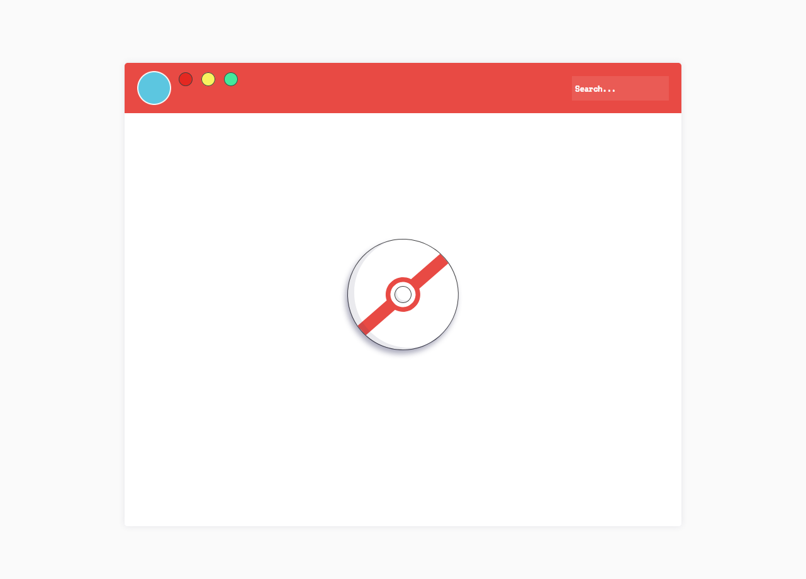
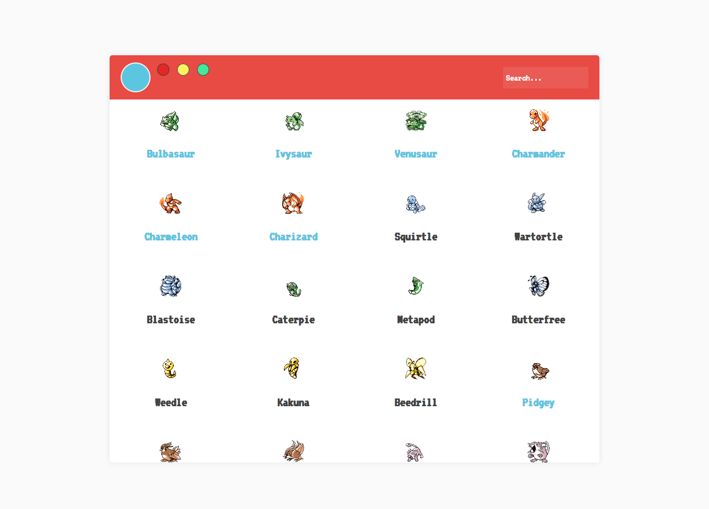
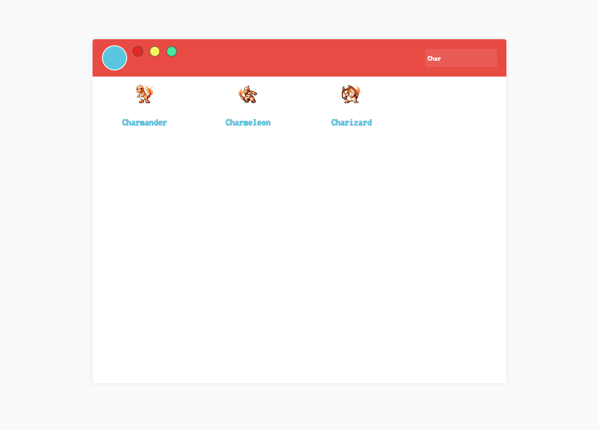
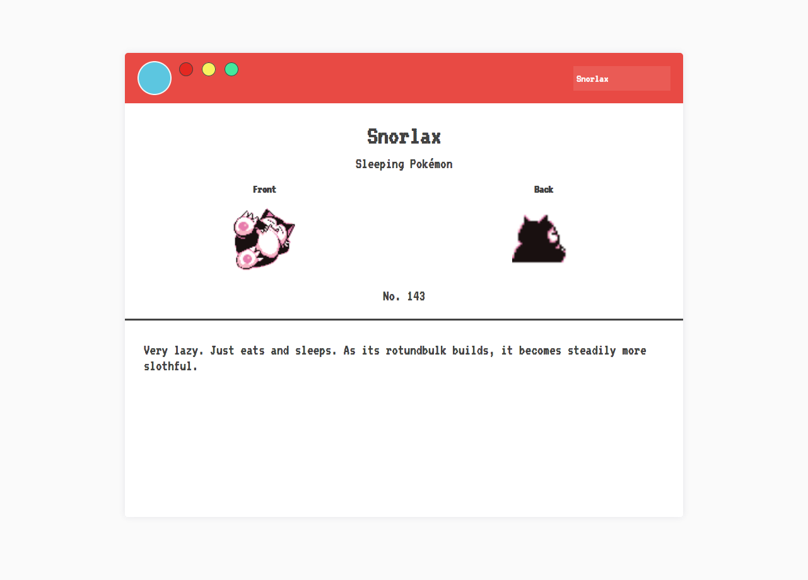

# NGDEX

 As anyone raised in the 90's would tell you, we LOVE Pokémon! So in order to become familiar with Angular and RxJS I created a simple Pokédex app for the original 151. The application retrieves its data from the [Pokéapi](https://pokeapi.co/) and the sprites where downloaded from [here](https://veekun.com/dex/downloads).

After loading users will see a list of all the original 151 pokémon located at the /pokedex route.

From here one may also search for a pokémon:

Clicking on a spite will route to the pokémon page e.g. /pokemon/1

This project was entirely an exercise to get acquainted with Angular. After building this app I can conclude that for me Angular is too opinionated. However, I can see the appeal for larger team projects where this level of constraint is beneficial. For instance it is very nice having the router and HTTP lib, state management all included. Coming from React, it saves the trouble of having to decide what library to use (even though nowadays things have kind of settled on Redux, Axios and React Router). Finally, I must say that I really like the RxJS. Observables are very powerful and I hope I can have a chance to use the library in a future project.

